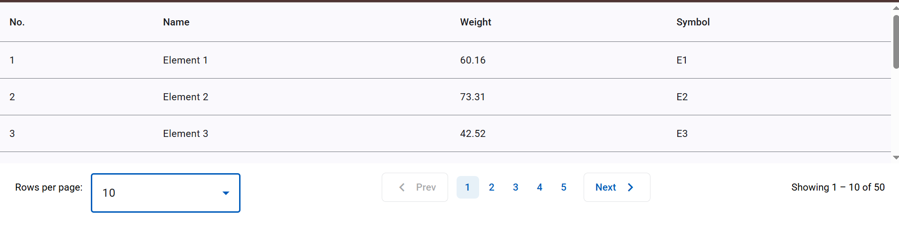

# Custom Angular Pagination Component

A lightweight, reusable, and customizable pagination component built with Angular and Angular Material. This mini-project demonstrates how to paginate tabular data with a modern UI and clean component structure.

## ✨ Features

- Works seamlessly with Angular Material tables  
- Customizable labels for navigation buttons (e.g., "Prev", "Next")  
- Responsive pagination layout with ellipsis for long page ranges  
- Configurable page size options  
- Emits page change and page size change events  
- Standalone component — easily copy and paste into any Angular app  
- Styled pagination layout  
- Fixed-height table with vertical scroll for smooth UX  

## 📁 Project Structure

```
src/
├── app/
│   ├── custom-paginator/
│   │   ├── custom-paginator.component.ts
│   │   ├── custom-paginator.component.html
│   │   └── custom-paginator.component.scss
│   ├── table-example/
│   │   ├── table-example.component.ts
│   │   ├── table-example.component.html
│   │   └── table-example.component.scss
```

## 🔧 How to Use

1. **Copy the `custom-paginator` folder** into your Angular project.

2. **Import necessary Angular Material modules**, such as:
```ts
import { MatSelectModule } from '@angular/material/select';
import { MatIconModule } from '@angular/material/icon';
import { MatButtonModule } from '@angular/material/button';
import { MatFormFieldModule } from '@angular/material/form-field';
```

3. Use the paginator in your component HTML like this:

```html
<app-custom-paginator
  [totalRecords]="totalRecords"
  [itemsPerPage]="pageSize"
  [currentPage]="currentPage"
  (pageChange)="onPageChange($event)"
  (pageSizeChange)="onPageSizeChange($event)"
></app-custom-paginator>
```

4. In your component TypeScript:

```ts
currentPage = 1;
pageSize = 10;
totalRecords = ELEMENT_DATA.length;

onPageChange(page: number): void {
  this.currentPage = page;
  this.updateTableData();
}

onPageSizeChange(size: number): void {
  this.pageSize = size;
  this.currentPage = 1;
  this.updateTableData();
}
```

5. Optional: Add fixed-height styling to your table container:

```scss
.table-container {
  max-height: 40vh;
  overflow-y: auto;
  margin-bottom: 16px;
}
```

## 🧠 Suggestions for Improvement

If you want to make this more reusable or turn it into a full library:

- Add i18n support for labels  
- Optional first/last navigation buttons  
- Theme agnostic with CSS variables  
- Turn it into an Angular library for `npm` installation  
- Add Jasmine/Karma unit tests  
- Include ARIA attributes for better accessibility  

## 🧪 Dependencies

- Angular  
- Angular Material  

To install Angular Material if not already:

```bash
ng add @angular/material
```

## 📸 Screenshots

<!-- Add screenshots or a GIF demo of the component here if desired -->



## 🤝 Contribution

This is a mini reusable pagination solution built for copy-paste usage in Angular apps. Fork or clone the repo to adapt it as needed!
